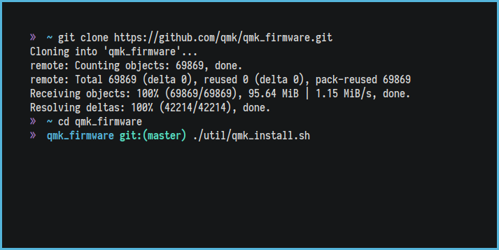
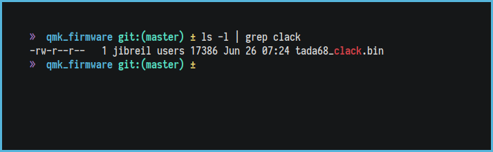

# Guide to creating a layout in QMK for the TADA68

## Step 1: setup QMK

### Environment setup

#### Windows

For Windows, follow the instructions [here in the documentation](https://docs.qmk.fm/#/newbs_getting_started?id=windows) as the method used for QMK on Windows changes every now and then.

#### Linux

For Linux, the only prerequisite required is `git` so install it via the following commands depending on your distribution:

* Debian/Ubuntu: `apt-get install git`
* Fedora/Redhat/Centos: `yum install git`
* Arch: `pacman -S git`

### QMK setup

First, we want to download the QMK files by cloning them, simply run

```bash
git clone clone https://github.com/qmk/qmk_firmware.git
```

Now go into the QMK folder with 

```bash
cd qmk_firmware
```

Finally, QMK includes an easy setup script to finish the process so run it by typing the following from the `qmk_firmware` directory

```bash
./util/qmk_install.sh
```



Now we can test the QMK environment by building a layout, let's try the default TADA one

```bash
make tada68:default:flashbin
```

Which should give an output like this


If this test build goes well, we're ready to make a layout.

## Step 2: create/edit a layout

QMK layouts are found in `keyboards/<keyboard>/keymaps/<keymap_name>/`. For example, the default layout for the TADA68 is `keyboards/tada68/keymaps/default/`.

To make your own layout, copy the `default` folder and rename it to something else, `clack` for example which would give us `keyboards/tada68/keymaps/clack/` which will have 3 files in it:

1. `keymap.c`
2. `readme.md`
3. `rules.mk`


Out of those 3, the `readme.md` file is not required but is present by default, the `rules.mk` file contains advanced build options for QMK and for most users can be left alone. The `keymap.c` file is where the magic happens and in here you can edit the default layout to your own liking. Thorough instructions for editing this can also be found in the [QMK docs.](https://docs.qmk.fm/#/newbs_building_firmware)

## Step 3: build the firmware

The TADA68 is unique to most other mechanical keyboards in terms of putting your own layout on it as you drop a `.bin` file on the keyboard as if it was a regular mass storage device rather than flashing a `.hex` file to the controller.

To generate the `.bin` file, just run the following command within the QMK root directory:

```bash
make tada68:<name>:flashbin
```

Where `<name>` is the name of the directory you created in step 2, following from our example where the name of the foler was `clack` you would run `make tada68:clack:flashbin`.


If there is an issue with your layout you'll get an error after the make command. If there are no errors, you'll find a shiny new `.bin` file in the QMK root directory, following our example again we'll find `tada68_clack.bin` in the root directory. This is the file you'll need to put onto your board.



## Step 4: loading your layout onto your keyboard

To get your layout onto your keyboard, plug it in and press the reset switch, it should show up as a removable device and you'll find a `.bin` file already on it with the default layout, the board only has enough storage for one layout os backup this file somewhere on your computer and replave it with the `.bin` file created in step 3.

When the new layout file is on the board, press escape to get the board out of the bootloader mode and it ***should*** be working on the new layout.
